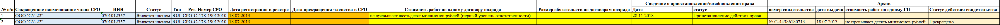
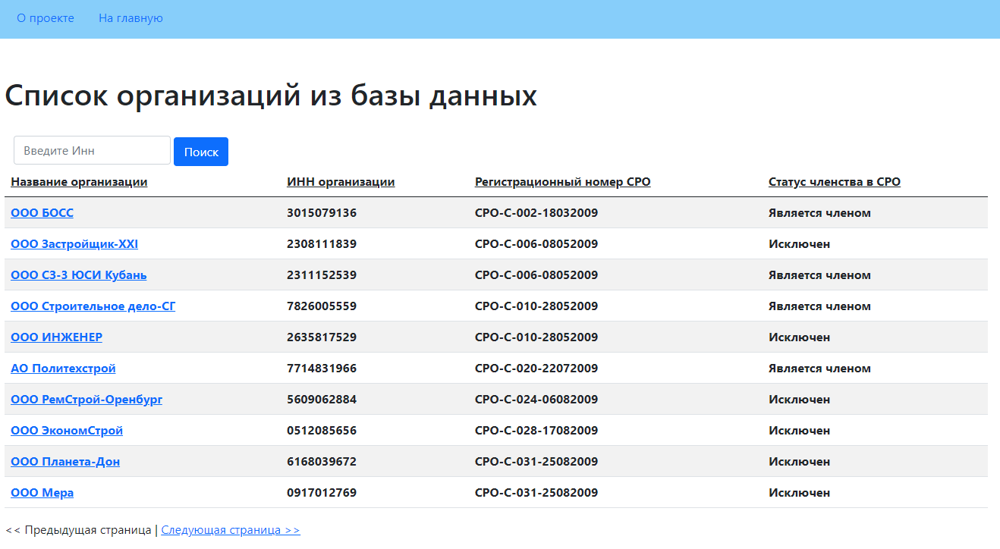
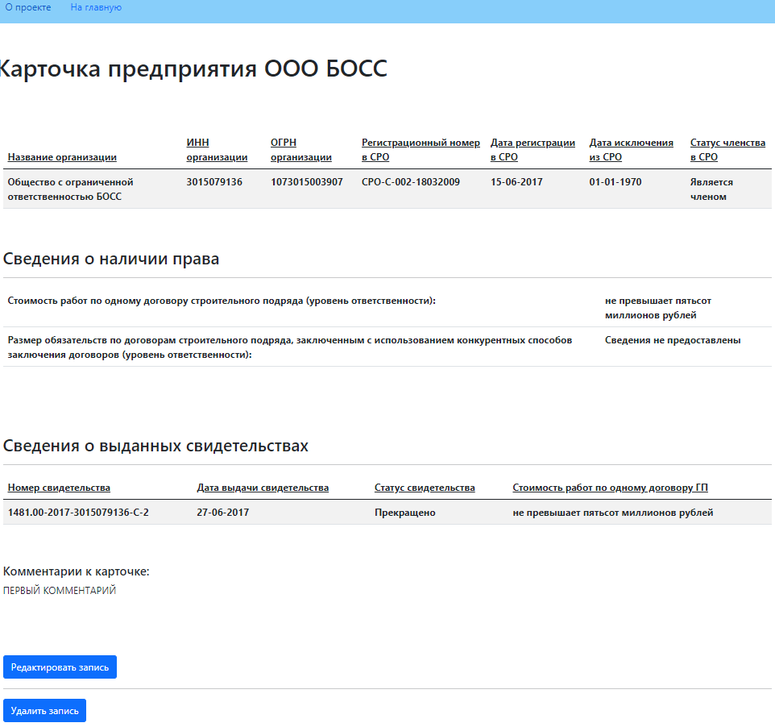
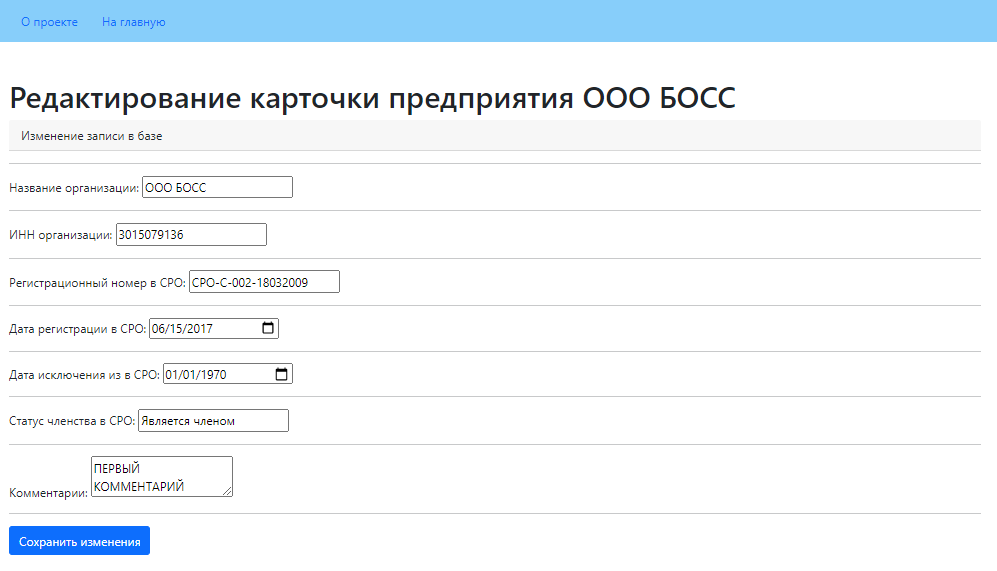

# Парсер сайта

## Техническое задание
### Цель проекта: Создать парсер сайта http://reestr.nostroy.ru (предпочтительнее использовать для создания ЯП Python)
1. На вход подается файл со списком ИНН организаций.
2. Принцип работы кода:
   - на странице "реестр членов СРО" происходит поиск по каждому ИНН из списка, если поиск выдает несколько страниц парсятся все результаты
   - столбцы шаблона 2-6 заполняются со страницы "реестр членов СРО" по результату поиска по ИНН
   - столбцы шаблона 7-8 заполняются со страницы "Сведения о члене СРО"
   - столбцы шаблона 9-12 заполняются со страницы "Сведения о наличии права"(при наличии данной информации)
   - столбцы шаблона 13-16 заполняются со страницы "Архив"(при наличии данной информации)
   - если имеется несколько записей - каждая запись выводится в новой строке с повторением общих данных организации.
3. На выходе создается файл по макету шаблона. Пример: 

4. Дополнительные условия: возможность многопоточной выгрузки информации.
5. Реализовать запись извлеченной информации в базу данных MS SQL.
6. Для созданной БД реализовать CRUD.
7. По созданному коду написать подробный Read me файл.
8. Реализовать пользовательский интерфейс.

## Стек:
`Python` `Scrapy` `SQLAlchemy` `Pandas` `Flask`

## Разворачивание проекта
Клонировать репозиторий:
> $ git@github.com:KonstantinVasilkov/parser_test_case.git

Перейти в папку проекта:
> $ cd ./parser_test_case

Создать виртуальное окружение:

- Windows

> $ py -m venv venv
>
> $ venv\Scripts\activate

Установить зависимости:
> $ pip install -r requirements.txt

## Описание порядка работы с проектом
Изначально необходимо запустить парсер. Так как именно он создает базу 
данных и без нее микро сервис пользовательского интерфейса не сможет 
запуститься. После того как база данных сформирована можно переходить к 
пункту 2.


## 1. Запуск парсера

**ВАЖНО!**
Для корректной работы необходимо разместить текстовый файл `inns.txt` в 
папку `./reestr_nostroy/input`. В файле на каждой новой строке должен быть 
записан один номер ИНН 
организации. Пример:
```
6154562770
6126003120
6127011942
2617010387
3025006722
7714831966
6167078252
3428984080
```
1. Перейти в папку парсера:
> $ cd ./reestr_nostroy
2. Запустить парсинг:
> $ python main.py
3. Profit!

В результате выполнения программы в папке `./reestr_nostroy/output` будет 
сохранена база данных с четырьмя таблицами и .csv файл установленного 
техническим заданием образца.

## Описание работы парсера:
При запуске происходит считывание файла `inns.txt` и все ИННы сохраняются в 
массив. Дальше инициализируется "паук", который начинает переходить по 
ссылкам поиска организации по ИНН вида 
`https://reestr.nostroy.ru/reestr?m.inn={}` подставляя в конце строки ИННы 
из списка по одному. 
С полученной в ответ страницы происходит парсинг первой части данных, 
которые сохраняются в базе данных в таблице `reest`.
Для однозначого индентифицирования каждой строки в базе данных, парсер 
получает ссылку на карточку каждого предприятия вида 
`/reestr/clients/152/members/389634` где первый набор из трех чисел это 
идентификационный номер СРО в базе данных сайта, а второй - 
идентификационный номер самого предприятия. Соединяя эти два номера мы 
получаем уникальный идентификационный номер `uid`. Этот номер используется 
дальше как ключ для соединения всех остальных таблиц. После считывания 
данных с основной страницы, парсер переходит на карточку предприятия и 
считывает остальные данные, переходя по закладкам на этой странице. 

После завершения работы парсера и наполнения базы данных вызывается 
служебная функция. Используя библиотеку `Pandas` она формирует таблицы, 
объединяет их в одну, убирая лишние столбцы и присваивает столбцам названия 
согласно ТЗ. После этого полученная сводная таблица сохраняется в папке 
`output`  в формате `.csv`.

Во время работы парсера все действия логируются и лог выполнения 
так же сохраняется в папке `output`.

## 2. Запуск пользовательского интерфейса

Это простое веб-приложения написанное с использованием фреймворков `Flask` 
и `SQLAlchemy`.

После того как парсер закончил свою работу, наберите в командной строке
> $ py user_interface/main.py

Откройте браузер и перейдите по ссылке:
> http://127.0.0.1:5000/

### Главная страница

На главной странице выводятся все основные данные по каждой компании. 
Реализован поиск по ИНН компании. Если в базе несколько компаний с 
одинаковым ИНН на страницу будут выведены все.

### Страница подробной информации о компании

На странице представлена подробная информация по каждой организации. Есть 
возможность перейти на форму редактирования карточки и удалить всю карточку 
из базы данных. После удаления карточки происходит редирект на главную 
страницу.

### Страница редактирования карточки предприятия



## Планируемые улучшения:
1. Запуск парсера с параметрами:
   - Указывать пути для входных и выходных данных
   - Перенаправлять логирование в стандартный вывод (консоль)
2. Покрытие программы тестами.
3. Упаковка программы в контейнер для разворачивания на удаленном сервере.
