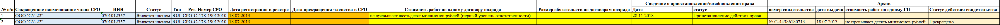

# Парсер сайта

## Техническое задание
### Цель проекта: Создать парсер сайта http://reestr.nostroy.ru (предпочтительнее использовать для создания ЯП Python)
1. На вход подается файл со списком ИНН организаций.
2. Принцип работы кода:
   - на странице "реестр членов СРО" происходит поиск по каждому ИНН из списка, если поиск выдает несколько страниц парсятся все результаты
   - столбцы шаблона 2-6 заполняются со страницы "реестр членов СРО" по результату поиска по ИНН
   - столбцы шаблона 7-8 заполняются со страницы "Сведения о члене СРО"
   - столбцы шаблона 9-12 заполняются со страницы "Сведения о наличии права"(при наличии данной информации)
   - столбцы шаблона 13-16 заполняются со страницы "Архив"(при наличии данной информации)
   - если имеется несколько записей - каждая запись выводится в новой строке с повторением общих данных организации.
3. На выходе создается файл по макету шаблона. Пример: 

4. Дополнительные условия: возможность многопоточной выгрузки информации.
5. Реализовать запись извлеченной информации в базу данных MS SQL.
6. Для созданной БД реализовать CRUD.
7. По созданному коду написать подробный Read me файл.
8. Реализовать пользовательский интерфейс.

## Стек:
`Python` `Scrapy` `SQLAlchemy`

## Разворачивание проекта

## Описание работы

